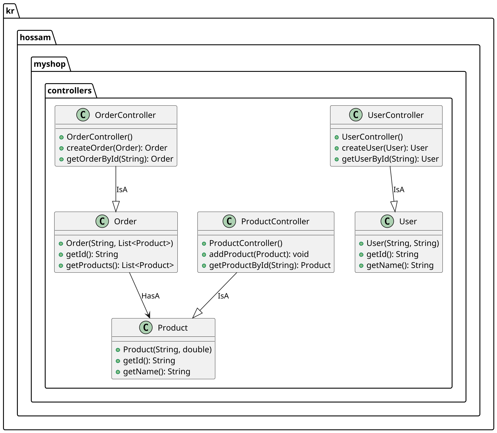

### PlantUML Code



### Instructions to Save the Diagram

1. **Create the UML Directory**: Ensure that you have a directory named `uml` in your project structure. If it doesn't exist, create it.

2. **Save the File**: Save the above PlantUML code in a file named `클래스이름_ClassDiagram.puml` within the `uml` directory.

### Example File Path
```
e:\study-myshop\uml\클래스이름_ClassDiagram.puml
```

### Note
- The classes and methods included in the diagram are examples. You should replace them with the actual classes and methods from your `kr.hossam.myshop.controllers` package.
- Ensure that the relationships (IsA, HasA) accurately reflect the actual relationships in your codebase. Adjust the diagram as necessary based on your actual class structure.